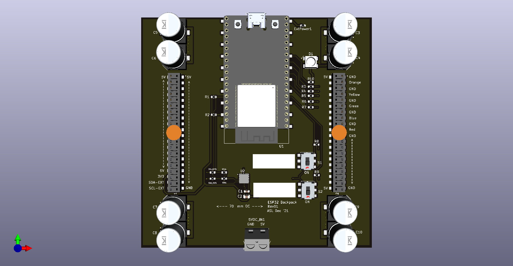
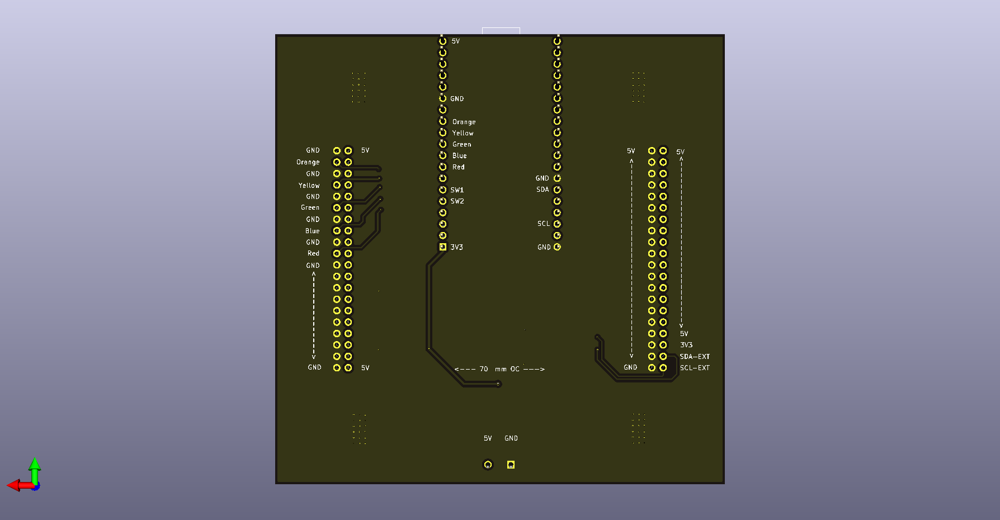

# esp32-backpack
This board is designed to couple to the back of the the [DC Metro Map](https://github.com/alorman/dc-map-500x500) and drive the LEDs.  
This daughterboard-style design is to allow for rapid iteration and testing on the driving board, while keeping the large and expensive map PCB separate.

## Images

## Schematic
[Schematic](exports/esp32-backpack-schematic.pdf)

## BOM
[Interactive BOM](exports/ibom.html)

## ESP Chipsets
ESP32 Chipsets come in about a zillion different configurations. To support the [code](https://github.com/alorman/dc_metro_map) you need a dual-core version. 

This board supports:
| Dev Kit Name         | Module           | Chipset       | Cores | Flash | SPRAM | Notes                 |
|----------------------|------------------|---------------|-------|-------|-------|-----------------------|
| ESP32-DevKitCVE      | ESP32-WROVER-E   | ESP32-D0WD-V3 | 2     | 4 MB  | 8 MB  | Full Size PCB Antenna |
| ESP32-DevKitC-32E    | ESP32-WROOM-32E  | ESP32-D0WD-V3 | 2     | 4 MB  | 4 MB  | Full Size PCB Antenna |
| ESP32-WROOM-32UE     | ESP32­WROOM­32UE | ESP32-D0WD-V3 | 2     | 4 MB  | 4 MB  | u.FL Connector        |
| HiLetgo ESP-WROOM-32 | ESP32-WROOM-32D  | ESP32-D0WD    | 2     | 4 MB  | 4 MB  | NRND, Amazon          |

Note: the HiLetGo (and likely other Amazonian boards) require a slight bending of the pins to fit.

## Fab Instructions
| | |
|-------------------|---------------:|
| Height (mm)       | 100            |
| Width (mm)        | 100            |
| Layers            | 2              |
| Thickness (mm)    | 1.6            |
| Solder Mask       | Black          |
| Silkscreen        | White          |
| Copper Thickness  | 1 oz           |
| Min Spacing       | 8/8mil         |
| Min Hole Size     | 8mil           |
| Via Process       | Tented         |
| Surface Treatment | HASL-Lead Free |
| Special Notes     | None           |